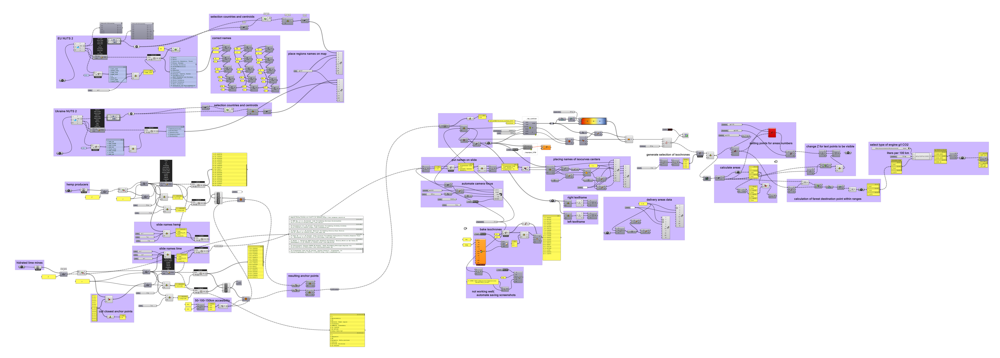

# Grasshopper_Isochrones_for_Hempcrete_Industry
## Data Vizualisation of isochrones by car drive time
Grasshopper script to evaluate isochrones of coverage area of hempcrete construction companies and visualize on a dynamic map 
tools: Grasshopper (Rhinoceros 3d 7), Hops, EarthEngine, Geojson.
## What I learned: 
- Data mining with Earth Engine and Hops plugin for Grasshopper.
- Data vizualisation with Grasshopper using plugin Torsier for camera control.
- Map vizualisation with Grasshopper using Hops plugin, Global Friction Surface 2019 from the Earth Engine Data Catalog.
- building isochrones in Grasshopper with Global Friction Surface, defining bias and granularity of processed map data.

## project concept
Hempcrete is the one a few non-toxic natural-based materials with relatively small embedded CO2 emissions and huge CO2 sequestering ability. Construction application of hempcrete is quite simple and does not bound us with construcion facilities like in the case of cement, all we need are hemp hurds, binder and lime pouder that we can mix right on a construction site. 
So, let's imagine that in order to mitigate CO2 logistic emissions for hempcrete we need to cover specific area with hemp and lime producing facilities. To analyze the current situation of the hempcrete industry we apply isochrones with centerpoints at production facilities. Resulting as dynamic maps the isochrones unveil areas of coverage area by car with 30, 60 and 120 min. Overlapping areas of lime and hemp isochrones we can describe as optimal areas for hempcrete constuction with minimal CO2 transport emissions.

## data visualization
### Dynamic map showing 200-km isochrones around locations of hempcrete producers in Europe

### Dynamic map showing 200-km isochrones around locations of lime producers in Europe

### Dynamic map with overlapping isochrones of hemp and lime producers, the optimal areas for hempcrete constuction with minimal CO2 transport emissions

### Map with overlapping isochrones of hemp and lime producers in Europe.

## Grasshopper defintiions
- creating isochrones [Grasshopper](Roman_submission_term1_CUD_02.gh)

- creating overlapping maps [Grasshopper](Roman_submission_term1_CUD_02_stage_2.gh)

## References

- Food and Agriculture Data, FAOSTAT. <https://www.fao.org/faostat/en/>
- Region Boundaries, NUTS 2. <https://ec.europa.eu/eurostat/web/nuts/nuts-maps>
- Members of European Industrial Hemp Association. <https://members.eiha.org/#/members-directory>
- Members of European Lime Association. <https://www.eula.eu/about/members/>
- Global Friction Surface 2019. <https://developers.google.com/earth-engine/datasets/catalog/Oxford_MAP_friction_surface_2019>
- Copernicus CORINE Land Cover CLC 2018. <https://developers.google.com/earth-engine/datasets/catalog/COPERNICUS_CORINE_V20_100m>
- GeoMining technology, Iacopo Neri. <https://github.com/neriiacopo/GeoMining-EE-Hops>
- Assessment of Carbon Sequestration of Hemp Concrete, Tarun Jami, Sumit Kumar. <https://www.researchgate.net/publication/320058537_Assessment_of_Carbon_Sequestration_of_Hemp_Concrete>
